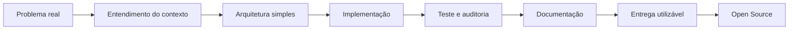

**Desenvolvedor Backend, maker de hardware, infraestrutura self-hosted e educador.**
**Código aberto, eletrônica crua e sistemas que funcionam de verdade.**

> *"Open source me trouxe até aqui. Minha intenção é manter tudo aberto."*

---

## Quem Eu Sou

Não sou só programador. Sou alguém que resolve problemas com código, hardware e infraestrutura — e documenta cada passo.

Comecei com Arduino nos componentes mais crus (AVR puro), passei por ESP, Raspberry Pi, Orange Pi, Banana Pi, Mango Pi, e montei um ecossistema inteiro de servidores self-hosted com Docker, Gitea, Nextcloud, AdGuard, Jellyfin e automações que rodam 24/7 em casa.

Sou professor também. Ensino backend, Python, Django, lógica, eletrônica e automação para pessoas reais — em sala de aula e nos materiais que publico.

---

## Projetos em Destaque

<table>
  <tr>
    <td width="50%">
      <h3>🔧 Arduino na Veia</h3>
      
<em>A Referência do Maker Brasileiro</em>

      
Site completo com tutoriais, componentes, projetos, glossário e ferramentas para Arduino e microcontroladores. Em constante expansão — de AVR puro a ESP32, Raspberry Pi Pico, STM32, PIC e muito mais.

      
📦 <strong>Stack:</strong> Go (stdlib) · HTML/CSS · SQLite · Docker

      
🔗 <a href="https://github.com/MiguelFAraujo/arduino-na-veia">Repositório</a> · <em>Link do site em breve</em> (domínio próprio em investigação)

    </td>
    <td width="50%">
      <h3>🏢 AMAJGI</h3>
      
<em>Portal Institucional da Associação de Moradores</em>

      
Plataforma com cadastro comunitário, painel administrativo, RBAC, LGPD, autenticação Google, exportação XLSX e documentação completa de segurança.

      
📦 <strong>Stack:</strong> Next.js · React · Supabase · Vercel

      
🔗 <a href="https://amajgi.vercel.app/">Acessar site</a>

    </td>
  </tr>
  <tr>
    <td width="50%">
      <h3>🤖 RoboTutor</h3>
      
Robô educacional open-source com Arduino, sensor ultrassônico e LEDs. Projeto didático para ensino de eletrônica e programação.

      
📦 <strong>Stack:</strong> Arduino · C++ · Eletrônica

      
🔗 <a href="https://github.com/MiguelFAraujo/RoboTutor">Repositório</a>

    </td>
    <td width="50%">
      <h3>🛡️ Sentinela</h3>
      
Sistema EDR caseiro usando Nmap, Python e Ollama (Phi-3). Monitoramento de rede local com detecção baseada em IA.

      
📦 <strong>Stack:</strong> Python · Ollama · Nmap · Docker

      
🔗 <a href="https://github.com/MiguelFAraujo/Sentinela">Repositório</a>

    </td>
  </tr>
  <tr>
    <td width="50%">
      <h3>🌱 GreenOpsMonitor</h3>
      
Monitoramento local de hardware com MCP e IA acessível. Sensor DHT22, consumo, temperatura e alertas inteligentes.

      
📦 <strong>Stack:</strong> Python · MCP · IA Local (Ollama)

      
🔗 <a href="https://github.com/MiguelFAraujo/GreenOpsMonitor">Repositório</a>

    </td>
    <td width="50%">
      <h3>📱 Bot Arduino na Veia</h3>
      
Telegram Bot interativo com formulário de contato, upload de arquivos e painel de feedback. Conecta comunidade maker ao admin.

      
📦 <strong>Stack:</strong> Go · Telegram Bot API · Systemd

      
🔗 Repositório privado (em fase de abertura)

    </td>
  </tr>
</table>

---

## 🔬 Infraestrutura Self-Hosted

Tenho um cluster caseiro com **11 containers Docker** rodando 24/7 em Raspberry Pi 4 + Orange Pi Zero 2W, conectados via NFS e Tailscale.

<strong>Ver detalhes da infraestrutura</strong>

### Raspberry Pi 4 (8GB)
| Serviço | Função |
|---------|--------|
| Nextcloud | Nuvem pessoal |
| AdGuard Home | DNS + bloqueio de anúncios |
| Jellyfin | Streaming multimídia |
| Gitea | Git self-hosted |
| Duplicati | Backup automatizado |
| Calibre | Biblioteca de eBooks |

### Orange Pi Zero 2W (Cluster Worker)
- **IA Local:** Ollama + TinyLlama + Qwen2.5-Coder 3B
- **OpenCode 24/7:** Agente de desenvolvimento autônomo com Groq + Gemini + DeepSeek
- **NFS Server:** Exporta SATA3 (219GB) para o RPi
- **Armazenamento:** 168GB livres em SATA3

### Infraestrutura de Rede
- **Tailscale:** VPN mesh entre RPi, OrangePi e dispositivos móveis
- **Tunelamento:** Acesso remoto seguro sem portas expostas
- **NFS:** RPi monta SATA3 do OrangePi via NFS (backups, dados compartilhados)
- **Gitea:** Git self-hosted com mirror para GitHub
- **Backup automatizado:** Scripts Python com rotação de 7 dias
- **Monitoramento:** Watchdog a cada 5 minutos + alertas Telegram

---

## 🧰 Hardware e Maker

Trabalho com eletrônica no nível dos componentes — AVR puro, sensores, servomotores, módulos, displays. Cada projeto é montado, testado e documentado do zero.

<strong>Placas e microcontroladores que uso</strong>

| Família | Modelos |
|---------|---------|
| **Arduino** | Uno, Nano, Mega, Pro Mini, ATtiny85 |
| **ESP** | ESP32, ESP8266, ESP32-CAM |
| **Raspberry Pi** | Pi 4 (8GB), Pi Pico, Pi Zero 2W |
| **Orange Pi** | Zero 2W (cluster worker) |
| **Banana Pi** | Testes e prototipação |
| **STM32** | Blue Pill, Black Pill |
| **PIC** | Microchip PIC16F, PIC18F |

Componentes que domino: sensores (ultrassônico HC-SR04, PIR, DHT22, LM35), servomotores SG90/MG995, motores DC + ponte H, módulos Relé, display LCD 16x2, matriz de LEDs, Bluetooth HC-05, WiFi ESP, RF 433MHz e muito mais.

---

## Stack

### Backend

### Frontend

### Infraestrutura

### Hardware & Maker

### Ferramentas & IA

---

## Meu Fluxo de Trabalho

Código bom precisa ter **contexto, decisão técnica, teste, documentação** — e de preferência, ser aberto para que outros aprendam e contribuam.

---

## Filosofia

Tenho um compromisso real com **código aberto**. Ele me trouxe até onde estou. Meus projetos são todos open-source (a maioria ainda privada enquanto amadurece, mas com intenção de abrir).

Uso **Gitea** como meu Git self-hosted para desenvolvimento interno, com mirror automático para GitHub. Tudo que construo passa por:

- 🔒 **Segurança desde o início** (LGPD, RBAC, criptografia, headers HTTP)
- 📖 **Documentação como parte do código** (não como depois)
- 🧪 **Testes e auditoria** (para entregar coisa que funciona)
- ♻️ **Backup automatizado** (porque dado bom merece proteção)

---

## Estatísticas

---

## Contato

**Open source me trouxe até aqui. Tudo que faço é aberto.**

