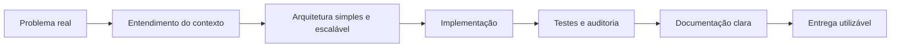

# Miguel Ferreira de Araujo

**Desenvolvedor Backend | Professor | Sistemas Web, Segurança e Automação**

Construo soluções úteis, documentadas e pensadas para pessoas reais. Tenho interesse especial em backend, plataformas institucionais, automação, inteligência artificial aplicada, segurança de dados e educação tecnológica.

---

## Sobre Mim

Sou desenvolvedor com base forte em Python, backend, ensino técnico e construção de sistemas práticos. Minha trajetória mistura sala de aula, engenharia de software, automação e projetos de impacto comunitário.

Meu foco atual está em criar aplicações completas com:

- autenticação segura;
- painéis administrativos;
- bancos relacionais;
- documentação profissional;
- boas práticas de LGPD e segurança;
- deploy em produção;
- interfaces simples para usuários não técnicos.

Gosto de projetos que saem do rascunho e viram ferramenta de verdade.

---

## Projeto Em Destaque

### AMAJGI - Portal Institucional e Painel Administrativo

Plataforma criada para a Associação de Moradores e Amigos de Jardim Guaratiba e Jardim Interlagos, em Maricá/RJ.

[Acessar o site](https://amajgi.vercel.app/) · [Repositório](https://github.com/MiguelFAraujo/AMAJGI)

O projeto evoluiu de um site institucional para uma plataforma com cadastro comunitário, painel administrativo, hierarquia de acesso, publicações, exportação XLSX, autenticação, documentação e camadas de segurança voltadas à LGPD.

**Principais entregas:**

- Portal público responsivo com avisos, eventos, campanhas, agradecimentos e reclamações.
- Cadastro de moradores, comerciantes e vínculos comunitários.
- Painel administrativo com níveis de permissão.
- Login Google com Supabase Auth.
- Sessão administrativa com cookie `HttpOnly`, `Secure` e `SameSite=Lax`.
- Criptografia AES-256-GCM para novos dados sensíveis.
- Headers HTTP de segurança e política CSP.
- Exportação administrativa em XLSX.
- Documentos de auditoria, segurança e roadmap técnico.

**Stack usada:**

---

## Áreas de Atuação

| Área | O que eu faço |
| --- | --- |
| Backend | APIs, autenticação, regras de negócio, banco de dados e integrações |
| Frontend | Interfaces responsivas com React, Next.js e TailwindCSS |
| Segurança | Sessões seguras, RBAC, headers, validação, logs e LGPD |
| Automação | Scripts, fluxos repetitivos, ferramentas internas e IA aplicada |
| Ensino | Explicação técnica, documentação, aulas e orientação de projetos |
| Maker | Arduino, Raspberry Pi, robótica educacional e prototipagem |

---

## Tech Stack

### Backend e Dados

### Frontend

### Infra, Segurança e Ferramentas

### IA, Educação e Maker

---

## Como Eu Trabalho

Valorizo código que pode ser explicado, mantido e apresentado. Um projeto bem feito precisa funcionar, mas também precisa deixar claro por que cada decisão técnica existe.

---

## Vitrine Técnica

<strong>Segurança e LGPD</strong>

Tenho estudado e aplicado práticas como:

- autenticação com provedores externos;
- cookies `HttpOnly`;
- controle de acesso por hierarquia;
- criptografia de dados sensíveis;
- validação de entrada;
- prevenção de vazamento de secrets;
- cabeçalhos HTTP de segurança;
- auditoria de ações administrativas;
- documentação de risco e plano de evolução.

<strong>Educação e Comunicação Técnica</strong>

Além de desenvolver, também gosto de ensinar. Tenho experiência explicando backend, Python, lógica, banco de dados, automação e projetos maker para públicos em diferentes níveis.

Um bom sistema não termina no código. Ele precisa ser compreensível por quem opera, apresenta e mantém.

<strong>Automação e IA Aplicada</strong>

Uso IA e automação como ferramentas para acelerar pesquisa, documentação, testes, prototipação e criação de fluxos internos. O objetivo é reduzir trabalho repetitivo e aumentar a qualidade da entrega.

---

## Estatísticas

---

## Contato

Para projetos, parcerias, conversas técnicas ou oportunidades:

[LinkedIn](https://www.linkedin.com/in/miguel-de-araujo)

---

**Tecnologia boa é a que resolve problema real, respeita as pessoas e pode ser mantida com responsabilidade.**

