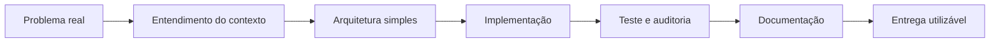

**Desenvolvedor Backend, professor e construtor de sistemas web com foco em utilidade real, documentação e segurança.**

---

## O Que Eu Construo

<table>
  <tr>
    <td width="33%">
      <h3>Plataformas Web</h3>
      
Aplicações com autenticação, painel administrativo, banco de dados, permissões, deploy e experiência responsiva.

    </td>
    <td width="33%">
      <h3>Segurança e LGPD</h3>
      
Sessões seguras, controle de acesso, logs, criptografia, headers HTTP, validação e documentação de risco.

    </td>
    <td width="33%">
      <h3>Educação e Automação</h3>
      
Conteúdo técnico, backend com Python, automações, IA aplicada e projetos maker com foco didático.

    </td>
  </tr>
</table>

Sou movido por projetos que saem do rascunho e viram ferramenta de verdade. Gosto de transformar ideias confusas em sistemas utilizáveis, com uma base técnica que possa ser explicada, testada e mantida.

---

## Case Em Produção: AMAJGI

### Portal Institucional e Painel Administrativo para Associação de Moradores

Plataforma criada para a **Associação de Moradores e Amigos de Jardim Guaratiba e Jardim Interlagos**, em Maricá/RJ.

O projeto evoluiu de um site institucional para uma plataforma com cadastro comunitário, painel administrativo, hierarquia de acesso, publicações, exportação XLSX, autenticação, documentação e camadas de segurança voltadas à LGPD.

### Entregas Relevantes

- Portal público com avisos, eventos, campanhas, agradecimentos e reclamações.
- Cadastro comunitário para moradores, comerciantes e vínculos locais.
- Painel administrativo com hierarquia e controle de permissões.
- Login Google com Supabase Auth.
- Sessão administrativa com cookie `HttpOnly`, `Secure` e `SameSite=Lax`.
- Criptografia AES-256-GCM para novos dados sensíveis.
- Headers HTTP de segurança e política CSP.
- Exportação administrativa em XLSX.
- Documentação de auditoria, segurança e roadmap técnico.

### Stack Do Case

---

## Tech Stack

### Backend e Dados

### Frontend

### Infra, Segurança e Ferramentas

---

## Meu Fluxo De Trabalho

Meu objetivo é entregar sistemas que funcionem, mas também possam ser apresentados com clareza. Código bom precisa ter contexto, decisão técnica, teste e documentação.

---

## Vitrine Técnica

<strong>Segurança, LGPD e auditoria</strong>

Práticas que estudo e aplico em projetos:

- autenticação com provedores externos;
- cookies `HttpOnly`;
- RBAC e menor privilégio;
- criptografia de dados sensíveis;
- validação de entrada;
- prevenção de vazamento de secrets;
- cabeçalhos HTTP de segurança;
- logs de ações administrativas;
- documentação de risco e plano de evolução.

<strong>Ensino e comunicação técnica</strong>

Também atuo como professor e comunicador técnico. Tenho experiência explicando backend, Python, lógica, banco de dados, automação e projetos maker para pessoas em diferentes níveis.

Para mim, um sistema bem construído também precisa ser compreensível por quem opera, apresenta e mantém.

<strong>Automação e IA aplicada</strong>

Uso IA e automação para acelerar pesquisa, documentação, testes, prototipação e criação de fluxos internos. A ideia não é substituir pensamento técnico, mas aumentar velocidade e qualidade de entrega.

---

## Estatísticas

---

## Contato

**Tecnologia boa resolve problema real, respeita as pessoas e pode ser mantida com responsabilidade.**

